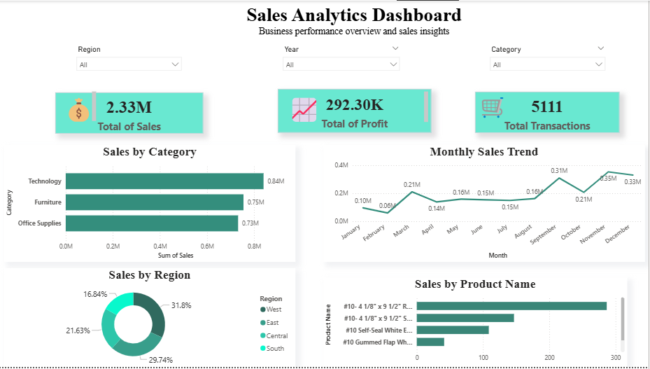

# 📊 Sales Analytics Dashboard

## 📌 Project Overview

This project is an interactive Sales Analytics Dashboard built using Power BI, Python, SQL, and Jupyter Notebook.

The project focuses on transforming raw sales data into meaningful business insights through data cleaning, SQL analysis, and interactive dashboard visualization.

The dashboard provides insights into:
- Sales performance
- Profit analysis
- Regional trends
- Product performance
- Monthly sales trends

---

# 🛠 Tools & Technologies Used

- Power BI
- Python
- Jupyter Notebook
- SQL
- VS Code
- CSV Dataset

---

# 📂 Project Workflow

1. Raw sales data collection
2. Data cleaning using Python
3. SQL analysis and querying
4. Data transformation
5. Dashboard creation in Power BI
6. Business insights visualization

---

# 📈 Dashboard Features

- Interactive slicers
- KPI cards
- Monthly sales trend analysis
- Regional sales analysis
- Product performance tracking
- Clean and modern dashboard design

---

# 📊 Key Insights

- Technology products generated the highest sales.
- The West region contributed the highest revenue share.
- Sales performance increased significantly during the final quarter.
- Top-performing products contributed a major portion of total sales.

---

# 🧠 Skills Demonstrated

- Data Cleaning
- Data Visualization
- Dashboard Design
- SQL Analysis
- Business Intelligence
- Analytical Thinking
- Reporting & Insights

---

# 📸 Dashboard Preview

---

# 🚀 Project Files

- `Dashboard_Analays_Project.pbix` → Power BI dashboard
- `data/` → raw and cleaned datasets
- `notebooks/` → Python notebook and SQL queries
- `images/` → dashboard screenshots

---

# 📬 Contact

Feel free to connect with me on LinkedIn and explore more of my projects.
